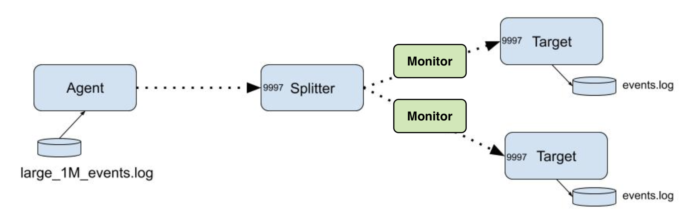
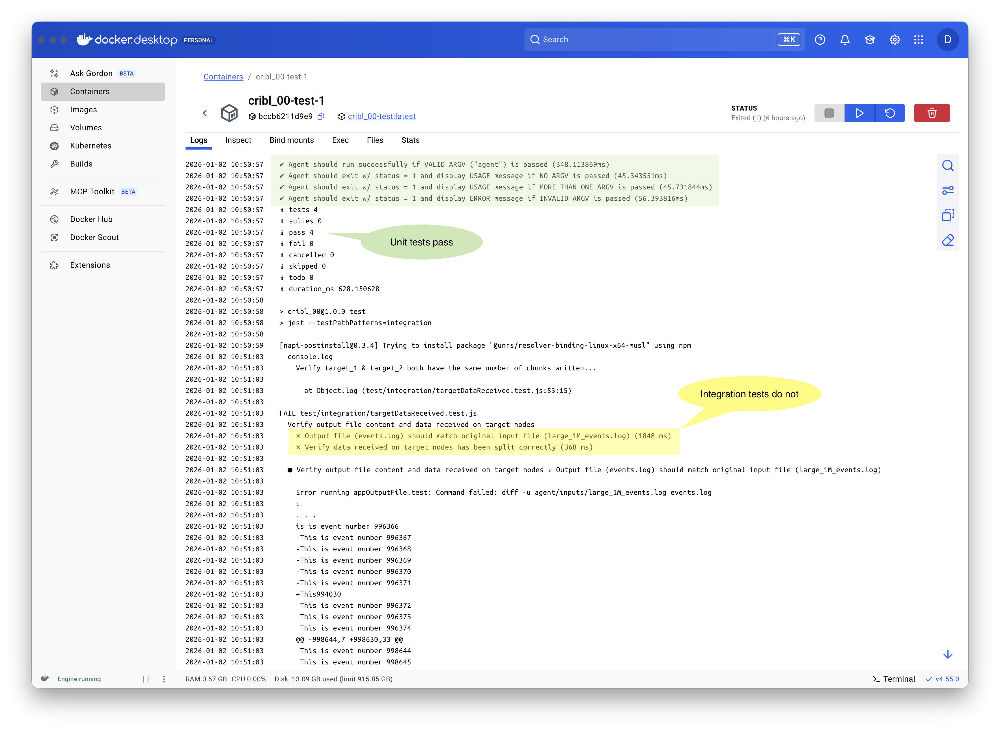
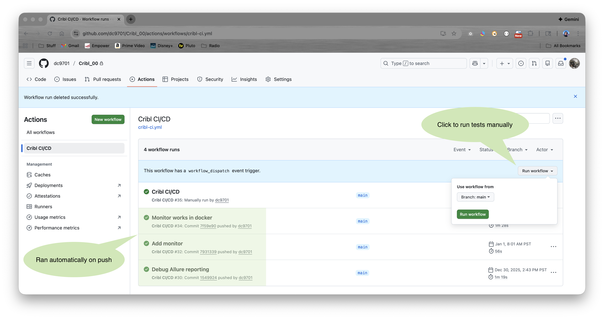
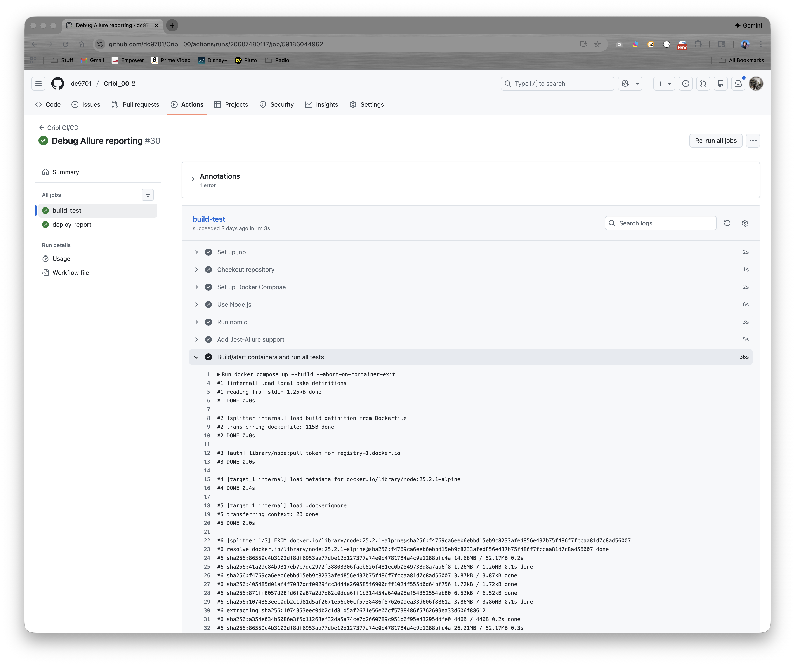
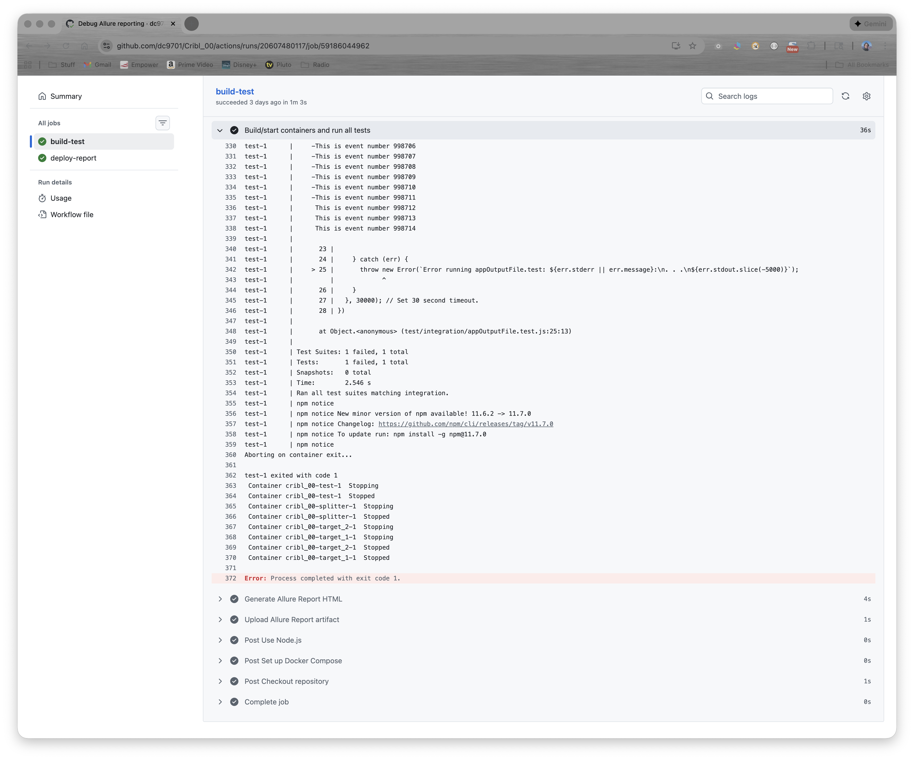
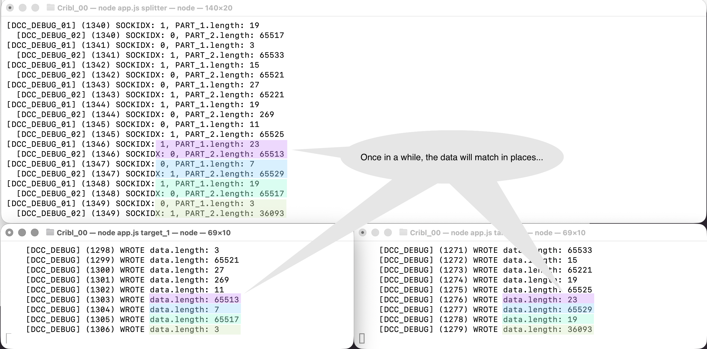
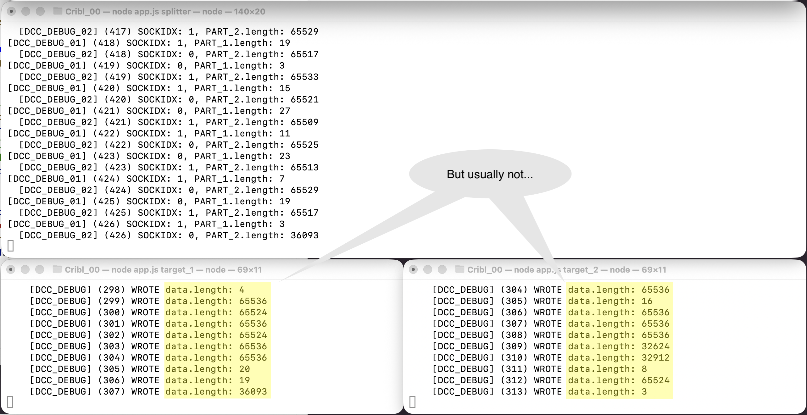

## Cribl - QA Engineering: Take Home Project (David Cooper)

### 1. Overview


This project exercises the Cribl "QA Engineering: Take Home Project" app, using the Node.js test runner for unit tests and Jest for integration tests.  Tests may be run locally via docker-compose or as part of a CI/CD pipeline using GitHub Actions.

Details on test design and how to run the tests are in the sections below, as well as observations on the test failures.  Lastly, since my application is for the "Sr SW Developer in Test (FedRamp)" position, our Toga Goat will share some FedRAMP thoughts.  Enjoy!

### 2. Test Design

For the objective of "**validates if data received on the ‘Target’ nodes are correct**", I took a two-pronged (horned?) approach:

- **appOutputFile.test** - Verify the resultant events.log file written by the two target nodes matches the original event stream simulated by large_1M_events.log.
- **targetDataReceived.test** - Monitors the data received by target_1 and target_2 nodes, then verifies:
	1. Data was split equally between target nodes (each received the same # of 'chunks').
  2. Each chunk has a part_1 and a part_2 that together total 64K.
  3. The "small part_1", "large part_2" pattern alternates consistently between the two targets. 

These two integration tests may be run via Jest with:  `npm test -- --testPathPatterns=integration`

For the optional "**any additional test cases that provide coverage**", I added some basic ARGV checks in the unit test **appCliArgv.test**:
  - Agent should run successfully if VALID ARGV ("agent") is passed.
  - Agent should exit w/ status = 1 and display USAGE message if NO ARGV is passed.
  - Agent should exit w/ status = 1 and display USAGE message if MORE THAN ONE ARGV is passed.
  - Agent should exit w/ status = 1 and display ERROR message if INVALID ARGV is passed.

These four unit tests may be run via the NodeJS test runner:  `node --test test/unit/*`

#### Let's dig into the design of 'targetDataReceived.test' a bit deeper:

Without modifying any of the original project code or configuration, I added two Monitor nodes to log the size of the data chunks (part_1, part_2) being sent from Splitter to target_1 & target_2:



The two Monitor containers have **hostnames** of `target_1` and `target_2`, so they intercept the output from Splitter and write it to their own log files (**target_1.log** & **target_2.log**) before passing the data chunks along to the actual Targets (named `tgt_1` and `tgt_2`), which then do their customary appends to **events.log**.

Splitter splits each of the 64K chunks of the input file between target_1 and target_2 that they can be sequentially appended to the output file such it is identical to the input file (large_1M_events.log).  Each 64K chunk is split on the first newline char; there will be a less-than 64K (36,096 bytes) final chunk.

Since each chunk is split on the first newline, and the longest line in the input file is 28 chars ('This is event number 1000000'), there will be a 'small part' (part_1, < 30 chars) and a remaining 'large part' (30 >= part_2 <= 65536 chars).  These two parts are written in alternating fashion to target_1 & target_2, such that the log for each target should show a consistent (part_1, part_2, part_1, part_2...).  Also, each combination of part_1 + part_2 for a given chunk should total 65536 bytes (including the newline char).

**Input File**:  large_1M_events.log
	27,888,896 bytes = 425 * 64 * 1,024 (425 chunks) + 36,096 byte final chunk.

Verification rules for how the input stream is split across the two targets::

1. Each chunk split between target_1 and target_2 should total 65,536 bytes (except for the last 36,096 bytes).
2. Logs for target_1 should indicate a write pattern of small (part_1), large (part_2), small, large....
3. Correspondingly, target_2 logs should have a write pattern of large (part_2), small (part_1), large, small.... 
4. The total number of writes to target_1 and target_2 should be equal, +/- one for the final 36,096-byte write.

Finally, the resultant output file (events.log) should be identical to the input file (large_1M_events.log); this is verified in **appOutputFile.test**.

### 3. Running Tests

When developing the tests, I used Visual Studio Code v1.107.1 and Docker Desktop v4.55.0 on a MacBook Pro running Tahoe 26.1.  I used Homebrew 5.0.4 to install Node v25.2.1 and Jest v30.1.3.  My GitHub repo is here:

https://github.com/dc9701/Cribl_00/blob/main/README.md

That covers some of the assignment's **Acceptance Criteria**; let's check off the rest of them:

#### My test suite includes:
```
test
├── integration
│   └── targetDataReceived.test.js
└── unit
    └── appCliArgv.test.js
```
As for test case documentation, I summarized their purpose/goals in **2. Test Design**, and each test case includes a **JSDoc** entry, like:

```
/**
  * Verify three aspects of how the input stream is split across the two targets:
  *    1. Data was split equally between target nodes (each received the same # of 'chunks').
  *    2. Each chunk has a part_1 and a part_2 that together total 64K.
  *    3. The "small part_1", "large part_2" pattern alternates between the two targets. 
  */
```
#### Node.js application and configuration files should not be modified in any way...

In fact, I found I didn't need to modify **inputs.json**, either.

#### Automated setup and teardown

Running the test suite locally (or via GitHub Actions) is done via `docker-compose`, which will automatically build, setup, run tests, and teardown the containers with this command:

- `docker compose up --build --abort-on-container-exit`

Similarly, tests may be re-run on demand with:  `docker compose run test`

And final tear down after on-demand testing:  `docker compose down`

*We'll get to running via commits or on-demand with GitHub Actions in just a moment...*

Here's a local Docker test run showing the four unit tests passing, but the two integration tests failing:



---
If you want to run the tests totally outside of Docker, you will need to:

1. Install requisite Node.js modules on your `localhost`, including:
    - `npm init -y`
    - `npm install -g jest`
    - `npm install csv-parse`
    - `npm install -g allure-jest allure-js-commons jest-environment-node`

2. Node.js v25.x may give you a warning:  `(node:67) Warning: --localstorage-file was provided without a valid path`, so set the following in your environment:
    - `export NODE_OPTIONS='--no-experimental-webstorage'`

3. Make copies of the `target` folder (`target_1` & `target_2`) and modify the ports in `inputs.json` (and the ports and hosts in `splitter/outputs.json`) as well as in `agent/outputs.json`, such that all hosts are `localhost`, but using different ports.

For example:

```
agent/outputs.json:
{
    "tcp" : {
        "host" : "localhost",
        "port" : 9997
    }
}

splitter/outputs.json:
{
    "tcp" : [
        {
            "host" : "localhost",
            "port" : 9998
        },
        {
            "host" : "localhost",
            "port" : 9999
        }
    ]
}

target_1/inputs.json:
{
    "tcp" : 9998
}

target_2/inputs.json:
{
    "tcp" : 9999
}
```

You can then open multiple terminal windows and start each app in a separate instance:

```
Terminal #4: node app.js target_2
Terminal #3: node app.js target_1
Terminal #2: node app.js splitter
Terminal #1: node app.js agent
```
---

*Now let's get back to how I've implemented the rest of the* **Acceptance Criteria**...

#### Integrate the Github repository with one of the publicly available CI/CD services

I integrated with my repo's **GitHub Actions** using `.github/workflows/cribl-ci.yml`.  In summary:

```
name: Cribl CI/CD
on:
  push:
  workflow_dispatch:

jobs:
  build-test:
    runs-on: ubuntu-latest

    steps:
      # Setup dependencies.
      - name: Checkout repository
        uses: actions/checkout@v5
      - name: Set up Docker Compose
        uses: docker/setup-compose-action@v1
      - name: Use Node.js
        uses: actions/setup-node@v4
      - run: npm ci
      - name: Add Jest-Allure support
        run: npm install -g allure-commandline allure-jest jest-environment-node

      # Start containers (target_1, target_2 & splitter) and run unit + integration tests.
      - name: Build/start containers and run all tests
        run: docker compose up --build --abort-on-container-exit
      - name: Upload log files as artifacts
        uses: actions/upload-artifact@v4
      - name: Generate Allure Report HTML
        run: allure generate allure-results --clean -o allure-report
      - name: Upload Allure Report artifact
        uses: actions/upload-pages-artifact@v3
        with:
          path: allure-report
          name: github-pages
          
  deploy-report:
    needs: build-test
    runs-on: ubuntu-latest
    environment:
      name: github-pages
      url: ${{ steps.deployment.outputs.page_url }} # Link to the published report
    steps:
      - name: Deploy to GitHub Pages
        id: deployment
        uses: actions/deploy-pages@v4 # Deploys the 'github-pages' artifact
```

With GitHub Actions, we integrate into the CI/CD process such that all tests are automatically run each time a commit is pushed.  One can also run the tests manually with the **Run Workflow** button.



Here we can see the `docker compose up --build` process starting:



And upon completion:



#### Capture all output and artifacts generated from each application/host

*<< UNDER CONSTRUCTION >>*

### 4. Observations

When I initially ran `node app.js agent` (after first launching the two TARGETS and SPLITTER), I expected the resultant **events.log** to be identical to the original **large_1M_events.log**.  It was not!

Hence, my first test compared the initial and resultant files for equality:  **targetDataReceived.test**.

But I wanted more detail as to WHY they weren't identical, so I temporarily added some logging to **splitter()** and **target()** in `app.js`.

Every run, **splitter()** was predictable and correct, splitting each 64K chunk of data on the first newline, writing the small 'part_1' and the larger 'part_2' alternately to SOCKIDX[0] (target_1) and SOCKIDX[1] (target_2).  Each run, it ended with the same sequence of sent bytes: ... 23/65513, 7/65529, 19/65517 & 3/36093 for the final chunk.

On the two targets, it was chaos - a different outcome every time:

**Run #1**:



**Run #2**:



**Run #3**:


In my second integration test (**targetDataReceived.test**), I focused on checking:
- **sameNumberChunks**:  Both targets received an equal # chunks written.
- **allChunksTotal64K**:  The part_1 & part_2 of each chunk total 64K.
- **goodChunksList**:  List of chunks matching small/large alternating pattern.

I suspect these two integration tests will fail consistently, as there are two independent TARGETS writing asynchronously to the same file (**events.log**).

Perhaps the **target()** nodes should write to a common sequential task **queue** (e.g., Bee-Queue or BullMQ), and the **queue** would do the actual file I/O in a more consistent fashion?

### 5. FedRAMP


Lorem ipsum dolor sit amet, consectetur adipiscing elit, sed do eiusmod tempor incididunt ut labore et dolore magna aliqua. Ut enim ad minim veniam, quis nostrud exercitation ullamco laboris nisi ut aliquip ex ea commodo consequat. Duis aute irure dolor in reprehenderit in voluptate velit esse cillum dolore eu fugiat nulla pariatur. Excepteur sint occaecat cupidatat non proident, sunt in culpa qui officia deserunt mollit anim id est laborum.
